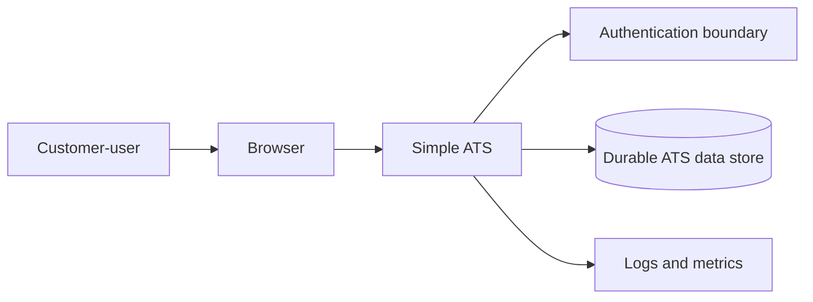
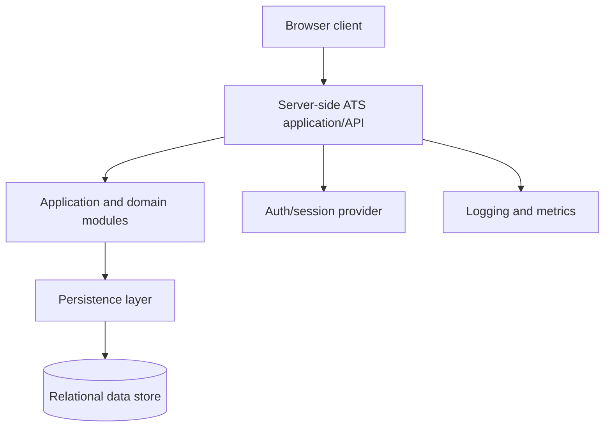
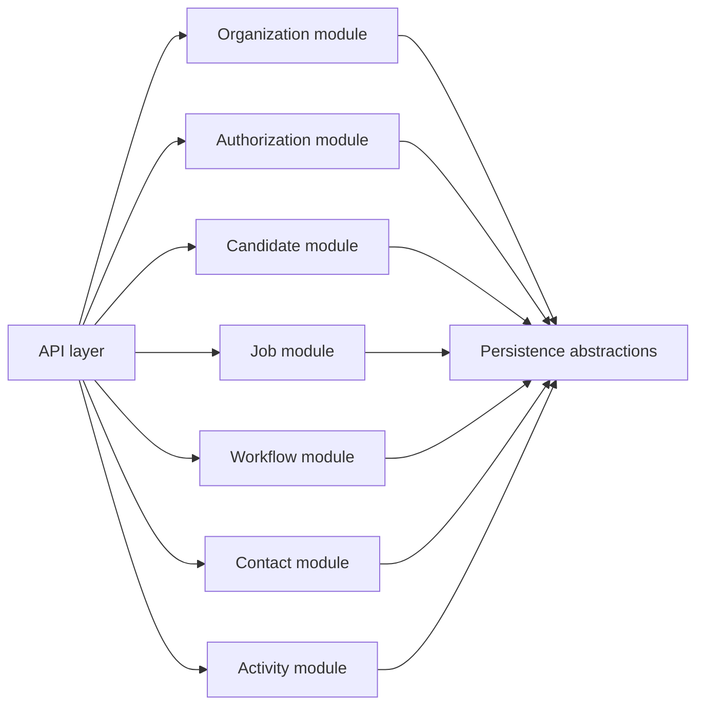

# Simple Applicant Tracking System Architecture Blueprint

- **Artifact ID**: CORE-SIMPLE-ATS-03-ARCHITECTURE
- **Version**: 1
- **Status**: ready
- **Core Version**: 1
- **Last Updated**: 2026-06-28
- **Source References**: requirements/simple-ats/requirements.md; .agents/blueprints/simple-ats/01-core/01-product.md; .agents/blueprints/simple-ats/01-core/02-domain.md

## Purpose

This artifact defines the durable technical architecture direction for the simple applicant tracking system. It constrains future design, implementation, testing, and validation decisions around component boundaries, dependency direction, tenant-aware data ownership, integration contracts, trust boundaries, and deployment topology.

The project is currently a partial greenfield blueprint. No ATS application implementation exists in this repository, so current-state claims are limited to the existing product and domain artifacts. Runtime components, deployment shape, and stack details below are intended architecture defaults, assumptions, or open questions unless marked as verified.

## Architecture context

The ATS should be a customer-facing web application where customer-users manage recruiting records inside a customer organization workspace. The target runtime shape is a browser client, a server-side application/API boundary, a durable data store, an authentication/session boundary, and an operational hosting environment. The architecture must preserve the domain rule that customer organization ownership governs access to candidates, jobs, contacts, workflows, and activity records.

Current verified state:

| Item | Status | Evidence |
|:---|:---|:---|
| Product and domain blueprint | Verified | `01-product.md` and `02-domain.md` exist and are marked `ready`. |
| Application runtime | Not implemented | No ATS application code is part of the current blueprint scope. |
| Stack, hosting, and authentication choices | Undecided | No accepted ADR or implementation repository evidence exists yet. |

Architecture-driving use cases:

| Use case | Architecture implication |
|:---|:---|
| Customer-user works inside one authorized customer organization workspace. | Every API and data access path needs server-side tenant scoping and role checks. |
| Recruiter creates and updates candidate, job, workflow, contact, and activity records. | The system needs reliable transactional CRUD/workflow operations with clear validation and persistence boundaries. |
| Candidate progress is tracked through candidate relationships and workflow stages. | Domain rules should live in backend application/domain modules, not only in UI components or database tables. |
| Recruiting activity records preserve shared context. | Activity writes need author, tenant, timestamp, target context, and safe handling of personal or sensitive content. |
| Administrators manage basic organization membership and roles. | Authentication, organization membership, and basic role authorization are first-class architecture boundaries. |

## Architecture drivers and constraints

| Driver ID | Driver | Architecture consequence |
|:---|:---|:---|
| `03ARCHI-DRIVER-SIMPLE-ATS-001` | Tenant isolation is core to product value. | Tenant ownership must be enforced in API authorization, database schema, query filters, tests, and validation evidence. |
| `03ARCHI-DRIVER-SIMPLE-ATS-002` | The product is a simple ATS foundation. | Prefer a modular monolith and relational data model over microservices, event sourcing, or integration-heavy architecture. |
| `03ARCHI-DRIVER-SIMPLE-ATS-003` | Candidate/contact records contain personal data. | Security, retention, deletion, auditability, and least-privilege access must be designed before production use. |
| `03ARCHI-DRIVER-SIMPLE-ATS-004` | Most first-version behavior is transactional record management plus workflow state. | A relational source of truth and server-side application modules are likely a strong default; asynchronous infrastructure should be introduced only when a use case requires it. |
| `03ARCHI-DRIVER-SIMPLE-ATS-005` | Operational overhead should stay low. | Prefer few deployables, managed infrastructure where appropriate, and simple CI/CD gates; exact hosting remains undecided. |
| `03ARCHI-DRIVER-SIMPLE-ATS-006` | External integrations are outside initial product scope. | Runtime dependencies on email, calendar, job boards, HRIS, AI, compliance providers, or public portals must not appear without a later accepted change. |

Optimizes for tenant isolation, clear backend enforcement of domain rules, fast delivery of recruiting record-management and workflow features, low early operational complexity, and a later path to split modules if needed.

Does not optimize for microservice autonomy, high-volume event streaming, external integration scale, public candidate portal traffic, multi-region active-active availability, or complex enterprise permission matrices yet.

Constraints:

| Constraint | Current position | Effect |
|:---|:---|:---|
| Implementation stack | Undecided; use web client plus server-side API plus relational store as the reversible architecture shape. | Specific language, framework, ORM, package manager, and test tooling must be chosen in an ADR before implementation planning. |
| Budget and operations | Prefer managed services and few deployables. | Avoid early Kubernetes, service mesh, and multi-service sprawl. |
| Regulatory/privacy | Personal-data retention/deletion is unresolved. | Blocks production handling of real candidate/contact data until resolved. |
| Product boundaries | No email/calendar sync, job boards, HRIS, AI screening, public portal, or advanced compliance workflows. | External integrations remain excluded unless a later change updates product scope. |
| Repository state | No ATS implementation exists yet. | Architecture is intended, not verified from code. |

## Architecture style and options

The recommended architecture style is a modular monolith first: one server-side application boundary with clear internal modules, one browser-facing UI, and one durable relational data store. This keeps the first version simpler than a distributed service architecture while preserving enough structure to split components later if scale, integration, security, or team ownership requires it.

This recommendation is a reversible architecture default, not an accepted ADR. It should become an ADR before implementation work fixes repository layout, framework choices, or deployment topology.

Split conditions:

- A module needs independent scaling, release cadence, or ownership that cannot be handled in-process.
- A bounded integration capability, such as external email or job-board distribution, is accepted as durable product scope.
- Operational evidence shows one module's workload materially harms the rest of the application.
- Compliance or data-isolation needs require a separate runtime or storage boundary.

| Option ID | Option | Fit | Strengths | Tradeoffs | Recommendation |
|:---|:---|:---|:---|:---|:---|
| `03ARCHI-ARCH-OPTION-SIMPLE-ATS-001` | Modular monolith web application with browser UI, server-side API, and relational database | Strong default | Low operational overhead, clear tenant enforcement point, straightforward transactional consistency, simple local development and testing. | Requires discipline to keep module boundaries from collapsing into generic CRUD code. | Recommended default pending ADR. |
| `03ARCHI-ARCH-OPTION-SIMPLE-ATS-002` | Microservices split by recruiting capability | Weak for first version | Independent deployability and scaling if modules become large. | Higher operational cost, distributed transactions, more failure modes, premature boundary decisions. | Reject for initial architecture unless future evidence triggers a split condition. |
| `03ARCHI-ARCH-OPTION-SIMPLE-ATS-003` | Serverless functions plus managed data services | Possible but not established | Can reduce idle infrastructure management and scale individual endpoints. | Can scatter domain rules, complicate transaction boundaries, and increase provider coupling. | Defer unless deployment constraints favor serverless. |
| `03ARCHI-ARCH-OPTION-SIMPLE-ATS-004` | Single full-stack monolith rendered mostly server-side | Viable alternative | Very simple deployment and strong server-side control. | May be less suitable if the product later needs richer browser interactions. | Consider during stack ADR if team skills favor it. |

Current position: use `03ARCHI-ARCH-OPTION-SIMPLE-ATS-001` as the recommended architecture style for subsequent design unless a later decision explicitly selects another option. The concrete language, UI framework, backend framework, database product, and hosting provider remain undecided.

## Architecture views

System context:

This view constrains the first version to a customer-user-facing browser application with server-side API enforcement and a durable ATS data store as the source of truth.

Container view:

This view keeps the browser, API, domain modules, persistence, data store, authentication, and observability as separate architectural responsibilities without committing to a specific framework or cloud service.

Module view:

This view constrains internal ownership. Domain modules may share infrastructure abstractions but should not bypass authorization or tenant ownership rules.

## Runtime components and modules

| Component ID | Component | Type | Responsibility | Owns | Inbound contracts | Outbound dependencies | Status/evidence |
|:---|:---|:---|:---|:---|:---|:---|:---|
| `03ARCHI-COMPONENT-SIMPLE-ATS-001` | Browser client | UI | Presents recruiting workflows, captures user actions, and renders organization-scoped ATS data. | Browser UI state, route-level interaction, client-side form validation, API request orchestration. | Browser navigation and user input; `03ARCHI-CONTRACT-SIMPLE-ATS-001` HTTPS application API. | Server-side ATS application/API; browser runtime. | Intended; no implementation yet. |
| `03ARCHI-COMPONENT-SIMPLE-ATS-002` | Server-side ATS application/API | API | Exposes application operations for candidates, jobs, workflows, contacts, activity, organization membership, and role-aware access. | API surface, request validation, authorization enforcement, transaction boundaries, domain use-case orchestration. | `03ARCHI-CONTRACT-SIMPLE-ATS-001` HTTPS application API. | Data store through persistence layer; authentication provider once selected; observability/logging services. | Intended; no implementation yet. |
| `03ARCHI-COMPONENT-SIMPLE-ATS-003` | ATS application/domain modules | Library | Encapsulate recruiting use cases and enforce domain rules before persistence. | Candidate, job, workflow, contact, activity, tenant, and role application behavior. | Internal calls from the ATS API. | Persistence abstractions; domain model. | Intended; required to protect domain rules from controller-only implementation. |
| `03ARCHI-COMPONENT-SIMPLE-ATS-004` | Relational ATS data store | Data store | Stores customer organizations, users, roles, candidates, jobs, workflows, contacts, activity records, and audit-relevant metadata. | Relational source of truth, tenant ownership keys, constraints, transactional consistency. | Data access through backend persistence layer. | Managed or self-hosted relational database service, undecided. | Assumed target; database product not selected. |
| `03ARCHI-COMPONENT-SIMPLE-ATS-005` | Authentication and session boundary | Service | Authenticates customer-users and supplies identity claims used by the API for organization and role authorization. | User identity proof, session or token validation, authentication lifecycle. | Browser login/session flow; API authorization checks. | Identity provider or first-party auth implementation, undecided. | Undecided; auth approach not yet selected. |
| `03ARCHI-COMPONENT-SIMPLE-ATS-006` | Hosting and runtime platform | Infrastructure | Runs deployable artifacts and connects them to managed configuration, networking, secrets, logs, and the data store. | Runtime hosting boundary, deployment units, environment configuration, network access. | Build artifacts from CI/CD. | Hosting provider, runtime service, secret management, observability, and database service. | Undecided; topology is intended only. |
| `03ARCHI-COMPONENT-SIMPLE-ATS-007` | Automated test harness | Test harness | Verifies domain rules, API contracts, tenant isolation, workflow transitions, and UI-critical behavior. | Unit, integration, API, and selected end-to-end tests. | Test commands and CI gates. | Application code, test database, browser automation where applicable. | Intended; exact tooling belongs in engineering blueprint. |

Major modules:

| Module ID | Module | Owns | Extension point | Split condition |
|:---|:---|:---|:---|:---|
| `03ARCHI-MODULE-SIMPLE-ATS-001` | Organization and membership | Customer organizations, customer-users, organization membership, basic roles. | Deeper enterprise permissions. | Split only if identity/tenant administration becomes independently complex. |
| `03ARCHI-MODULE-SIMPLE-ATS-002` | Authorization | Server-side policy checks for organization membership and basic roles. | Role expansion or policy engine. | Split only if permission policy becomes complex enough to require separate ownership. |
| `03ARCHI-MODULE-SIMPLE-ATS-003` | Candidate | Candidate profile, contact details, and organization-local candidate identity. | Duplicate handling, merge, deletion, anonymization. | Split only if candidate data lifecycle or search becomes a separate bounded capability. |
| `03ARCHI-MODULE-SIMPLE-ATS-004` | Jobs and candidate relationships | Job openings and candidate-to-job or candidate-to-workflow relationships. | Multiple job contexts, status history, reopening rules. | Split only if recruiting pipeline workload becomes independently scalable. |
| `03ARCHI-MODULE-SIMPLE-ATS-005` | Workflow | Workflow stages and candidate relationship state validation. | Organization-wide or job-specific workflow configuration. | Split only if workflow rules become an independent workflow engine. |
| `03ARCHI-MODULE-SIMPLE-ATS-006` | Contacts | Company contacts and internal contacts. | Contact conversion or contact-user linkage. | Split only if contacts become CRM-like scope. |
| `03ARCHI-MODULE-SIMPLE-ATS-007` | Activity | Notes, interactions, next steps, authorship, context attachment. | Audit timeline, reminders, notifications. | Split only if activity becomes event/notification infrastructure. |

## Boundaries and dependency rules

1. `03ARCHI-ARCH-BOUNDARY-SIMPLE-ATS-001` - The browser client must access ATS data only through the server-side application/API. It must not connect directly to the durable data store or bypass server-side tenant authorization.
   - Major violation example: browser code reads or writes the data store directly, or embeds database connection details in client configuration. This should be caught by code review, dependency scan, frontend build review, and secret scan.
2. `03ARCHI-ARCH-BOUNDARY-SIMPLE-ATS-002` - The backend must enforce customer organization ownership on every read and write for organization-owned records. Tenant filtering cannot be left only to UI routing or client-provided identifiers.
   - Major violation example: an API endpoint lists candidates by `candidateId` or `jobId` without scoping the query to the authenticated customer organization. This should be caught by API tests, tenant-isolation tests, query review, and validation.
3. `03ARCHI-ARCH-BOUNDARY-SIMPLE-ATS-003` - API controllers should delegate business operations to application/domain modules rather than embedding recruiting rules directly in HTTP handlers.
   - Major violation example: controller actions directly implement workflow transition rules instead of delegating to the workflow or candidate relationship module. This should be caught by backend design review, module dependency review, and unit tests for application/domain modules.
4. `03ARCHI-ARCH-BOUNDARY-SIMPLE-ATS-004` - Persistence code may depend on database infrastructure, but domain and application rules must not depend on hosting-provider APIs, framework-specific transport objects, or browser concepts.
   - Major violation example: domain/application modules depend on cloud SDK types, container runtime settings, HTTP request objects, or environment variable names to decide candidate status behavior. This should be caught by static dependency review, module tests, and architecture validation.
5. `03ARCHI-ARCH-BOUNDARY-SIMPLE-ATS-005` - External integrations such as email, calendar, job boards, HRIS, AI screening, background checks, or document signing must not be introduced as runtime dependencies without an accepted product change.
   - Major violation example: a future email, calendar, job-board, HRIS, or AI integration is called directly from the browser client or from a domain module. This should be caught by impact analysis, architecture review, and dependency review.
6. `03ARCHI-ARCH-RULE-SIMPLE-ATS-001` - Every persistent table that stores organization-owned recruiting data must include an enforceable customer organization ownership key or equivalent tenant boundary.
7. `03ARCHI-ARCH-RULE-SIMPLE-ATS-002` - Backend tests must include tenant-isolation coverage for APIs that list, read, create, update, or delete organization-owned records.
8. `03ARCHI-ARCH-RULE-SIMPLE-ATS-003` - The first architecture should remain a modular monolith unless a later accepted decision establishes a separate deployable service boundary.
   - Major violation example: the Activity module writes candidate status changes directly in persistence tables owned by the Candidate or Workflow module. This should be caught by repository/module review, persistence abstraction review, and integration tests.
9. `03ARCHI-ARCH-RULE-SIMPLE-ATS-004` - Company contacts and internal contacts must remain contact records, not authenticated users, unless a later accepted product and architecture change expands contact authority.
   - Major violation example: company contacts or internal contacts are treated as login users because they share a name or email field. This should be caught by domain validation, auth design review, and API tests.

## Data architecture

| ID | Source | Destination | Trigger | Data class | Boundary crossed | Persistence behavior | Failure handling |
|:---|:---|:---|:---|:---|:---|:---|:---|
| `03ARCHI-DATA-SIMPLE-ATS-001` | Server-side ATS application/API | Relational ATS data store | Customer-user creates or updates organization records. | Customer organization, user membership, roles, candidates, jobs, workflows, contacts, activity records. | Application-to-data-store trust boundary; customer organization ownership boundary. | The data store is the source of truth. Writes must preserve customer organization ownership. | Failed writes return API errors and must not partially commit multi-record operations. |
| `03ARCHI-FLOW-SIMPLE-ATS-001` | Browser client | Server-side ATS application/API | Customer-user loads workspace views or submits changes. | Recruiting records and personal/contact data. | Browser-to-server network boundary; authenticated user boundary. | Client holds transient UI state only. Durable state remains server/data-store-owned. | API failures surface recoverable UI errors without implying data was saved. |
| `03ARCHI-FLOW-SIMPLE-ATS-002` | Authentication/session boundary | Server-side ATS application/API | User signs in or makes an authenticated request. | Identity claims, organization membership, role claims or lookup keys. | Identity trust boundary. | Authentication state may be session or token based; durable user membership remains ATS-owned unless an external identity provider is selected. | Invalid or expired identity fails closed. |
| `03ARCHI-FLOW-SIMPLE-ATS-003` | Server-side ATS application/API | Operational logs and metrics | Requests, errors, health checks, and security-relevant events occur. | Tenant-safe diagnostics, request metadata, error data. | Application-to-observability boundary. | Logs and metrics must avoid leaking personal data or cross-tenant content. | Telemetry failures must not expose tenant data or corrupt business transactions. |
| `03ARCHI-FLOW-SIMPLE-ATS-004` | Test harness | Test data store | Automated verification runs. | Seeded tenant, candidate, job, workflow, contact, and activity records. | Test environment boundary. | Test data must be isolated from production data. | Failed tests block acceptance evidence. |

The relational store should keep tenant-owned ATS data in schema areas that make customer organization ownership explicit and queryable. Candidate/contact personal data retention, deletion, and anonymization are not yet defined and must be resolved before production handling of real personal data.

Migration posture: use versioned schema migrations before any durable implementation. Migration strategy should become `03ARCHI-ADR-SIMPLE-ATS-004`.

## Integration architecture

| Contract ID | Provider | Consumer | Format/protocol | Versioning expectation | Compatibility rule | Error behavior | Status/evidence |
|:---|:---|:---|:---|:---|:---|:---|:---|
| `03ARCHI-CONTRACT-SIMPLE-ATS-001` | Server-side ATS application/API | Browser client | HTTPS application API, exact format undecided | Documented compatibility policy required before public release. | Client-visible response shapes cannot change without coordinated UI updates and tests. | Return structured errors for validation, authorization, not found, conflict, and server failure cases. | Intended. |
| `03ARCHI-CONTRACT-SIMPLE-ATS-002` | ATS application/domain modules | Server-side ATS application/API | In-process application service calls | Internal contract evolves with backend code, covered by tests. | Domain rules cannot be bypassed by controllers or persistence helpers. | Invalid operations fail with typed application errors that map to API responses. | Intended. |
| `03ARCHI-CONTRACT-SIMPLE-ATS-003` | Persistence layer and data store | ATS application/domain modules | Repository/query interfaces backed by relational storage, exact technology undecided | Schema migrations must be versioned once implementation begins. | Persistence changes must preserve tenant ownership and domain invariants. | Data-store failures roll back current transaction and return safe API errors. | Intended. |
| `03ARCHI-CONTRACT-SIMPLE-ATS-004` | Authentication/session boundary | Browser client and server-side ATS application/API | Undecided: session cookie, token, managed identity provider, or first-party identity | Must be stable before production user authentication. | API must validate identity server-side and map identity to customer organization membership. | Authentication failures fail closed and do not disclose tenant data. | Undecided. |
| `03ARCHI-CONTRACT-SIMPLE-ATS-005` | Observability boundary | Runtime operators and validation evidence | Logs, metrics, health responses, traces where selected | Operational baseline required before production. | Diagnostics must be tenant-safe and must not contain unnecessary personal data. | Observability failures should degrade diagnostics, not business data integrity. | Intended. |

Integration rules:

1. External systems are excluded by default until product scope changes.
2. Any future external integration must use an adapter boundary owned by the backend, not direct browser-to-third-party business integration.
3. Any integration that can create duplicate external effects must define idempotency and retry behavior before implementation.
4. Any integration handling personal data must update trust boundaries, data architecture, quality requirements, and ADRs.
5. Public APIs for third parties are not established; any future public API requires a scoped change and compatibility policy.

## Trust boundaries and security posture

1. `03ARCHI-TRUST-SIMPLE-ATS-001` - Browser-to-API boundary: all client input is untrusted. The API must validate request shape, authorization, tenant ownership, and state transitions server-side.
2. `03ARCHI-TRUST-SIMPLE-ATS-002` - Customer organization boundary: tenant isolation is the central security boundary. Every organization-owned query and command must be scoped by authorized organization membership.
3. `03ARCHI-TRUST-SIMPLE-ATS-003` - Personal-data boundary: candidate, contact, and activity records may contain personal or sensitive information. Collection, access, retention, deletion, and audit expectations need explicit quality requirements before production use.
4. `03ARCHI-TRUST-SIMPLE-ATS-004` - API-to-data-store boundary: database credentials and connection strings must be held in environment or secret management, not client code or source-controlled plaintext.
5. `03ARCHI-TRUST-SIMPLE-ATS-005` - Runtime configuration and secrets boundary: deployed runtime units should run with least-privilege network and platform permissions, exposing only intended HTTP endpoints.
6. `03ARCHI-TRUST-SIMPLE-ATS-006` - Authentication boundary: the system must not treat company contacts or internal contacts as login users unless a later accepted change expands contact authority.
7. `03ARCHI-TRUST-SIMPLE-ATS-007` - Operations and diagnostics boundary: logs, metrics, traces, and support tooling must avoid leaking candidate/contact personal data or cross-tenant record content.

## Deployment and operational topology

The intended deployment topology is simple and environment-separated:

- Local development runs the browser client, server-side ATS application/API, and test data store with reproducible configuration.
- Test/CI environments run automated unit, integration, contract, tenant-isolation, and selected end-to-end checks against isolated test data.
- Staging should mirror production architecture closely enough to validate migrations, configuration, health checks, and deployment behavior.
- Production should run a small number of deployable units: browser asset delivery, server-side ATS application/API, relational data store, authentication/session boundary, secret/configuration source, and observability path.

Hosting provider, cloud service, container strategy, serverless strategy, database service, CDN/static asset approach, CI/CD system, backup policy, monitoring stack, and rollback policy are undecided. They should be resolved through engineering guidance and ADRs before implementation fixes deployment behavior.

Operational expectations:

| Concern | Architecture expectation | Detailed owner |
|:---|:---|:---|
| Health checks | API exposes liveness/readiness; database connectivity is checked safely. | `06-engineering.md` and implementation plan. |
| Logging | Server logs include request correlation and tenant-safe diagnostic context. | `04-quality.md` and `06-engineering.md`. |
| Metrics | API latency, error rate, database errors, and auth failures are observable. | `04-quality.md`. |
| Backup/recovery | Backup and restore expectations for durable recruiting data must be defined before production. | `04-quality.md` and deployment ADR. |
| Migrations | Migrations are versioned and run through controlled deployment steps. | `06-engineering.md` and `03ARCHI-ADR-SIMPLE-ATS-004`. |
| Rollback | Application rollback and migration rollback/forward-fix policy must be defined. | `06-engineering.md`. |

## Architecture risks and tradeoffs

| Risk ID | Risk or tradeoff | Why accepted or plausible | Impact | Mitigation or watch signal | Carries forward to |
|:---|:---|:---|:---|:---|:---|
| `03ARCHI-ARCH-RISK-SIMPLE-ATS-001` | Tenant leakage through query or API mistakes. | A shared application/data-store architecture relies on disciplined server-side scoping. | High security and product trust impact. | Mandatory tenant keys, API authorization checks, and tenant-isolation tests. | `03ARCHI-ARCH-RULE-SIMPLE-ATS-001`; `04-quality.md`. |
| `03ARCHI-ARCH-RISK-SIMPLE-ATS-002` | CRUD-only backend with weak domain boundaries. | ATS features are CRUD-heavy, so rules can drift into controllers or UI. | Workflow and authority bugs become likely. | Application/domain modules and controller delegation boundary. | `03ARCHI-ARCH-BOUNDARY-SIMPLE-ATS-003`; `03ARCHI-ADR-SIMPLE-ATS-001`. |
| `03ARCHI-ARCH-RISK-SIMPLE-ATS-003` | Authentication model selected too late. | Auth provider/session model is undecided. | Rework in API, UI, deployment, and tests. | Resolve before login or membership implementation. | `03ARCHI-QUESTION-SIMPLE-ATS-ARCH-001`; `03ARCHI-ADR-SIMPLE-ATS-003`. |
| `03ARCHI-ARCH-RISK-SIMPLE-ATS-004` | Personal-data lifecycle under-specified. | Candidate/contact data naturally contains personal information. | Privacy, compliance, and deletion behavior may require schema changes. | Resolve retention/deletion before production data. | `03ARCHI-QUESTION-SIMPLE-ATS-ARCH-003`; `04-quality.md`. |
| `03ARCHI-ARCH-RISK-SIMPLE-ATS-005` | Hosting choice affects cost and operations. | Runtime service, data-store hosting, networking, secrets, and observability are not selected. | Deployment rework or unexpected operational cost. | ADR before deployment implementation. | `03ARCHI-ADR-SIMPLE-ATS-002`; `06-engineering.md`. |
| `03ARCHI-ARCH-RISK-SIMPLE-ATS-006` | Modular monolith may become too coupled. | A single deployable can hide module boundary violations. | Later service extraction becomes expensive. | Explicit module table, dependency rules, and split conditions. | `03ARCHI-MODULE-*`; `03ARCHI-ARCH-RULE-SIMPLE-ATS-003`. |

## Architecture decisions

No ADR files are accepted yet. The following decision candidates should become ADRs before or during implementation when each decision becomes material:

1. `03ARCHI-ADR-SIMPLE-ATS-001` - Select the primary application style and stack. Current architecture default is a modular monolith web application with browser UI, server-side API, and relational data store.
2. `03ARCHI-ADR-SIMPLE-ATS-002` - Choose hosting and deployment topology, including runtime service, browser asset delivery, environment separation, and rollback approach.
3. `03ARCHI-ADR-SIMPLE-ATS-003` - Choose authentication approach: first-party identity, managed identity provider, cookie session, JWT, or another model.
4. `03ARCHI-ADR-SIMPLE-ATS-004` - Define database migration and tenant-isolation enforcement strategy.
5. `03ARCHI-ADR-SIMPLE-ATS-005` - Define personal-data retention, deletion, anonymization, and audit architecture.
6. `03ARCHI-ADR-SIMPLE-ATS-006` - Define API versioning and compatibility policy.
7. `03ARCHI-ADR-SIMPLE-ATS-007` - Define observability baseline: logs, metrics, traces, health checks, and tenant-safe diagnostics.
8. `03ARCHI-ADR-SIMPLE-ATS-008` - Define external integration policy for future email, calendar, job-board, HRIS, AI, and compliance-provider changes.
9. `03ARCHI-ADR-SIMPLE-ATS-009` - Define module boundary enforcement strategy.

## Assumptions and open questions

| ID | Type | Importance | Applies to | Current position | Why it matters | Resolution path |
|:---|:---|:---|:---|:---|:---|:---|
| `03ARCHI-ASSUMPTION-SIMPLE-ATS-ARCH-001` | Assumption | High | Architecture style | Start as a modular monolith with clear internal boundaries rather than microservices. | This keeps delivery simple while preserving tenant and domain boundaries. | Confirm or replace during `03ARCHI-ADR-SIMPLE-ATS-001` before first implementation plan. |
| `03ARCHI-ASSUMPTION-SIMPLE-ATS-ARCH-002` | Assumption | Medium | UI/API separation | Use a browser client that talks to a server-side application/API. | This affects client-visible contracts, auth flow, and deployment units. | Confirm during stack ADR and first implementation plan. |
| `03ARCHI-ASSUMPTION-SIMPLE-ATS-ARCH-003` | Assumption | Medium | Database tenancy | Tenant isolation can initially use shared relational tables with required customer organization ownership keys. | This affects schema design, query filters, indexing, tests, and data migration strategy. | Confirm during data model design and migration planning. |
| `03ARCHI-QUESTION-SIMPLE-ATS-ARCH-001` | Question | High | Authentication/session boundary | Authentication provider and session model are not selected. | Identity strategy affects user management, API authorization, frontend state, deployment configuration, and security testing. | Resolve before implementing customer-user login or organization membership. |
| `03ARCHI-QUESTION-SIMPLE-ATS-ARCH-002` | Question | Medium | Deployment topology | Hosting provider, runtime service, and CI/CD topology are not selected. | These choices affect networking, secrets, observability, cost, and rollback strategy. | Decide during engineering blueprint or first deployment-focused change. |
| `03ARCHI-QUESTION-SIMPLE-ATS-ARCH-003` | Question | High | Personal-data lifecycle | Retention, deletion, anonymization, and audit expectations are not defined. | Production handling of candidate/contact data can create privacy and compliance risk. | Resolve before production use with real personal data. |
| `03ARCHI-QUESTION-SIMPLE-ATS-ARCH-004` | Question | Medium | Workflow configuration | Organization-wide versus job-specific workflow ownership is not final. | This affects schema design, API contracts, and validation rules. | Resolve before implementing workflow configuration. |
| `03ARCHI-QUESTION-SIMPLE-ATS-ARCH-005` | Question | Medium | API compatibility | Public or private API compatibility policy is not defined. | Compatibility expectations affect client release coordination and future integrations. | Resolve before public release or third-party API exposure. |

## Generation stop conditions

| Condition | Status | Why it stops generation | Current assessment |
|:---|:---|:---|:---|
| Tenant ownership boundary is unresolved | Clear | Tenant ownership changes would alter component rules, schema design, API authorization, and tests. | The domain establishes customer organization ownership as the governing boundary. |
| Architecture style would be fixed irreversibly without approval | Clear | A different style changes repository layout, deployment, test strategy, and cost profile. | The file records a reversible modular-monolith default and requires ADR confirmation before implementation planning. |
| Authentication model is needed for production auth | Clear | Auth choices affect trust boundaries, user lifecycle, and API authorization behavior. | Not blocking architecture generation; must be resolved before login or membership implementation. |
| Personal-data lifecycle is needed for production use | Clear | Retention and deletion choices affect data model, audit behavior, and operational controls. | Not blocking architecture generation; must be resolved before production handling of real candidate/contact data. |
| Deployment topology would create material cost or production authority | Clear | Hosting and production operations choices affect cost, secrets, data exposure, and operational responsibility. | Not selected here; must be resolved before deployment implementation or production operation. |
| External integrations are requested | Clear | Email, calendar, job boards, HRIS, AI, or compliance integrations would change product dependencies and architecture contracts. | No such integration is in scope. Later requests must enter the change lifecycle. |
