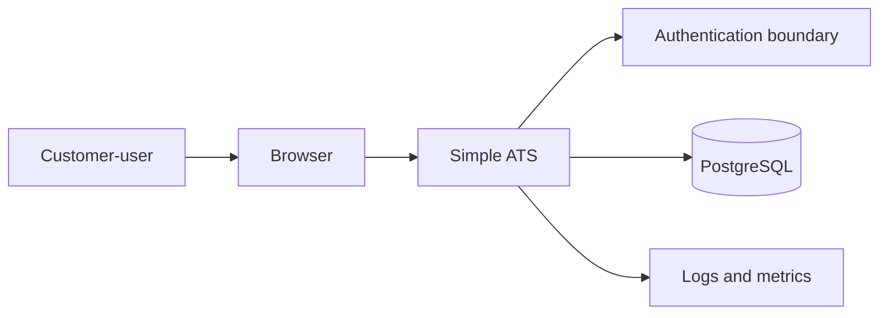
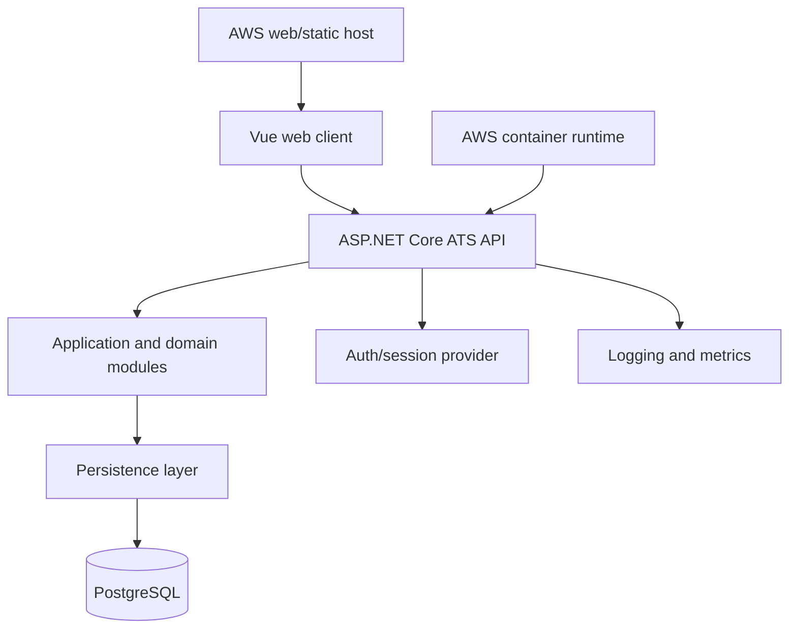
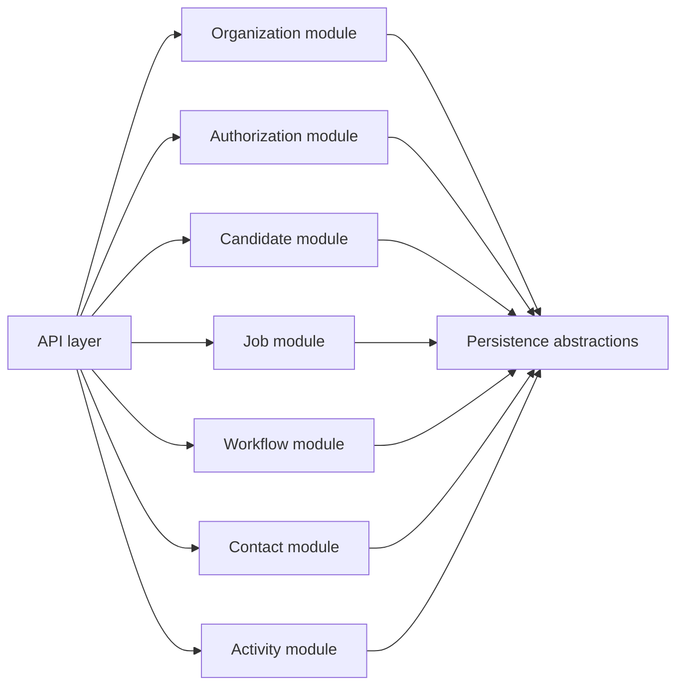

# Simple Applicant Tracking System Architecture Blueprint

- **Artifact ID**: CORE-SIMPLE-ATS-03-ARCHITECTURE
- **Version**: 1
- **Status**: ready
- **Core Version**: 1
- **Last Updated**: 2026-06-28
- **Source References**: .agents/blueprints/simple-ats/01-core/01-product.md; .agents/blueprints/simple-ats/01-core/02-domain.md; user stack direction on 2026-06-28

## Purpose

This artifact defines the durable technical architecture direction for the simple applicant tracking system. It constrains future design, implementation, testing, and validation decisions around component boundaries, dependency direction, tenant-aware data ownership, integration contracts, trust boundaries, and deployment topology.

The project is currently a partial greenfield blueprint. No implementation repository evidence exists for the ATS application yet, so current-state claims are limited to the existing product and domain artifacts. Runtime components, deployment shape, and stack details below are intended architecture recommendations unless marked otherwise.

## Architecture context

The ATS should be built as a browser-based business application with a client UI, a server-side application/API layer, a relational source of truth, and containerized deployment on AWS. The architecture must preserve the product promise of a simple, multi-customer recruiting workspace and the domain rule that customer organization ownership governs access to candidates, jobs, contacts, workflows, and activity records.

Architecture-driving use cases:

| Use case | Architecture implication |
|:---|:---|
| Customer-user works inside one authorized customer organization workspace. | Every API and data access path needs server-side tenant scoping and role checks. |
| Recruiter creates and updates candidate, job, workflow, contact, and activity records. | The system needs reliable transactional CRUD/workflow operations with clear validation and persistence boundaries. |
| Candidate progress is tracked through candidate relationships and workflow stages. | Domain rules should live in backend application/domain modules, not only in UI components or database tables. |
| Recruiting activity records preserve shared context. | Activity writes need author, tenant, timestamp, target context, and safe handling of personal or sensitive content. |
| Administrators manage basic organization membership and roles. | Authentication, organization membership, and basic role authorization are first-class architecture boundaries. |

## Architecture drivers and constraints

| Driver ID | Driver | Architecture consequence |
|:---|:---|:---|
| `DRIVER-SIMPLE-ATS-001` | Tenant isolation is core to product value. | Tenant ownership must be enforced in API authorization, database schema, query filters, tests, and validation evidence. |
| `DRIVER-SIMPLE-ATS-002` | The product is a simple ATS foundation. | Prefer a modular monolith and relational data model over microservices, event sourcing, or integration-heavy architecture. |
| `DRIVER-SIMPLE-ATS-003` | Candidate/contact records contain personal data. | Security, retention, deletion, auditability, and least-privilege access must be designed before production use. |
| `DRIVER-SIMPLE-ATS-004` | Most first-version behavior is transactional CRUD plus workflow state. | PostgreSQL and server-side application modules are a strong fit; asynchronous infrastructure should be introduced only when a use case requires it. |
| `DRIVER-SIMPLE-ATS-005` | Operational overhead should stay low. | Prefer managed AWS services, one API deployable, one UI deployable, managed PostgreSQL, and simple CI/CD gates. |

Optimizes for tenant isolation, fast delivery of recruiting CRUD/workflow features, clear backend domain boundaries, PostgreSQL-backed consistency, low early operational complexity, and a later path to split modules if needed.

Does not optimize for microservice autonomy, high-volume event streaming, external integration scale, public candidate portal traffic, multi-region active-active availability, or complex enterprise permission matrices yet.

Constraints:

| Constraint | Current position | Effect |
|:---|:---|:---|
| Team skills | Assume `.NET`, Vue, PostgreSQL, and AWS containers are acceptable. | Makes `STACK-SIMPLE-ATS-001` the recommended default. |
| Budget and operations | Prefer managed services and few deployables. | Avoid early Kubernetes, service mesh, and multi-service sprawl. |
| Regulatory/privacy | Personal-data retention/deletion is unresolved. | Blocks production handling of real candidate/contact data until resolved. |
| Product boundaries | No email/calendar sync, job boards, HRIS, AI screening, public portal, or advanced compliance workflows. | External integrations remain excluded unless a later change updates product scope. |
| Repository state | No ATS implementation exists yet. | Architecture is intended, not verified from code. |

## Architecture style and options

The recommended architecture is a modular monolith first: one deployable backend API with clear internal module boundaries, one browser UI, and one PostgreSQL database. This keeps the first version simpler than a distributed service architecture while preserving enough structure to split components later if scale or team ownership requires it.

Split conditions:

- A module needs independent scaling, release cadence, or ownership that cannot be handled in-process.
- A bounded integration capability, such as external email or job-board distribution, is accepted as durable product scope.
- Operational evidence shows one module's workload materially harms the rest of the application.
- Compliance or data-isolation needs require a separate runtime or storage boundary.

| Option ID | Stack | Fit | Strengths | Tradeoffs | Recommendation |
|:---|:---|:---|:---|:---|:---|
| `STACK-SIMPLE-ATS-001` | Vue SPA + ASP.NET Core API + PostgreSQL + AWS ECS/Fargate or App Runner | Strong default for a tenant-aware SaaS CRUD/workflow product. | Mature backend ecosystem, strong typing, good API/test tooling, good fit for PostgreSQL and AWS containers, clear path for modular monolith boundaries. | Requires .NET capability and careful API/domain layering to avoid an anemic CRUD-only backend. | Recommended default unless team skill or delivery constraints favor another stack. |
| `STACK-SIMPLE-ATS-002` | Vue SPA + NestJS API + PostgreSQL + AWS ECS/Fargate or App Runner | Good when the team wants TypeScript across UI and API. | Shared language across frontend/backend, productive API development, strong ecosystem for validation and testing. | Runtime type boundaries and domain modeling need discipline; long-term backend complexity can become less explicit than .NET if conventions are weak. | Viable alternative for a TypeScript-heavy team. |
| `STACK-SIMPLE-ATS-003` | Vue SPA + Django REST API + PostgreSQL + AWS containers | Good for rapid admin/data-heavy delivery. | Fast CRUD delivery, strong ORM/admin capabilities, mature security defaults, excellent PostgreSQL fit. | Python/Django conventions may be less aligned with a strongly layered domain model unless enforced deliberately. | Viable if speed of data-management features is the priority. |
| `STACK-SIMPLE-ATS-004` | Vue SPA + Ruby on Rails API or Hotwire app + PostgreSQL + AWS containers | Good for a small team optimizing for product iteration speed. | Very fast feature delivery, mature relational modeling, strong conventions for CRUD workflows. | Vue SPA plus Rails API adds cross-stack complexity; Rails full-stack would change the UI architecture direction. | Consider only if the team already prefers Rails conventions. |

Current position: use `STACK-SIMPLE-ATS-001` as the recommended target for subsequent design unless a later decision explicitly selects another option. The architecture below assumes the `.NET + Vue + PostgreSQL + AWS containers` path while keeping the choice reversible before implementation begins.

## Architecture views

System context:

This view constrains the first version to a customer-user-facing browser application with server-side API enforcement and PostgreSQL as the source of truth.

Container view:

This view keeps the browser, API, domain modules, persistence, and database as separate architectural responsibilities even when deployed simply.

Module view:

This view constrains internal ownership. Domain modules may share infrastructure abstractions but should not bypass authorization or tenant ownership rules.

## Runtime components and modules

| Component ID | Component | Type | Responsibility | Owns | Inbound contracts | Outbound dependencies | Status/evidence |
|:---|:---|:---|:---|:---|:---|:---|:---|
| `COMPONENT-SIMPLE-ATS-001` | Vue web client | UI | Presents recruiting workflows, captures user actions, and renders organization-scoped ATS data. | Browser UI state, route-level interaction, client-side form validation, API request orchestration. | Browser navigation and user input; `CONTRACT-SIMPLE-ATS-001` HTTPS API. | ATS API; browser runtime. | Intended; based on selected stack direction. |
| `COMPONENT-SIMPLE-ATS-002` | ASP.NET Core ATS API | API | Exposes application operations for candidates, jobs, workflows, contacts, activity, organization membership, and role-aware access. | API surface, request validation, authorization enforcement, transaction boundaries, domain use-case orchestration. | `CONTRACT-SIMPLE-ATS-001` HTTPS JSON API. | PostgreSQL database; authentication provider once selected; observability/logging services. | Intended; recommended default stack. |
| `COMPONENT-SIMPLE-ATS-003` | ATS application/domain modules | Library | Encapsulate recruiting use cases and enforce domain rules before persistence. | Candidate, job, workflow, contact, activity, tenant, and role application behavior. | Internal calls from the ATS API. | Persistence abstractions; domain model. | Intended; required to protect domain rules from controller-only implementation. |
| `COMPONENT-SIMPLE-ATS-004` | PostgreSQL database | Data store | Stores customer organizations, users, roles, candidates, jobs, workflows, contacts, activity records, and audit-relevant metadata. | Relational source of truth, tenant ownership keys, constraints, transactional consistency. | SQL access through backend persistence layer. | AWS managed database service or containerized local database in development. | Intended; based on user stack direction. |
| `COMPONENT-SIMPLE-ATS-005` | Authentication and session boundary | Service | Authenticates customer-users and supplies identity claims used by the API for organization and role authorization. | User identity proof, session or token validation, authentication lifecycle. | Browser login/session flow; API authorization checks. | Identity provider or first-party auth implementation, undecided. | Undecided; auth approach not yet selected. |
| `COMPONENT-SIMPLE-ATS-006` | AWS container runtime | Infrastructure | Runs the web/API containers and connects them to managed configuration, networking, logs, and PostgreSQL. | Runtime hosting boundary, container deployment, environment configuration, network access. | Container images from CI/CD. | AWS ECS/Fargate or App Runner; AWS networking and logging; database service. | Intended; exact AWS service choice undecided. |
| `COMPONENT-SIMPLE-ATS-007` | Automated test harness | Test harness | Verifies domain rules, API contracts, tenant isolation, workflow transitions, and UI-critical behavior. | Unit, integration, API, and selected end-to-end tests. | Test commands and CI gates. | Application code, test database, browser automation where applicable. | Intended; exact tooling belongs in engineering blueprint. |

Major modules:

| Module ID | Module | Owns | Extension point | Split condition |
|:---|:---|:---|:---|:---|
| `MODULE-SIMPLE-ATS-001` | Organization and membership | Customer organizations, customer-users, organization membership, basic roles. | Deeper enterprise permissions. | Split only if identity/tenant administration becomes independently complex. |
| `MODULE-SIMPLE-ATS-002` | Candidate | Candidate profile, contact details, candidate-local identity. | Duplicate handling, merge/anonymization. | Split only if candidate data lifecycle or search becomes a separate bounded capability. |
| `MODULE-SIMPLE-ATS-003` | Jobs and candidate relationships | Job openings and candidate-to-job/workflow relationships. | Multiple job contexts, status history. | Split only if recruiting pipeline workload becomes independently scalable. |
| `MODULE-SIMPLE-ATS-004` | Workflow | Workflow stages and candidate relationship state validation. | Organization-wide or job-specific workflow configuration. | Split only if workflow rules become an independent workflow engine. |
| `MODULE-SIMPLE-ATS-005` | Contacts | Company contacts and internal contacts. | Contact conversion or contact-user linkage. | Split only if contacts become CRM-like scope. |
| `MODULE-SIMPLE-ATS-006` | Activity | Notes, interactions, next steps, authorship, context attachment. | Audit timeline, reminders, notifications. | Split only if activity becomes event/notification infrastructure. |

## Boundaries and dependency rules

1. `ARCH-BOUNDARY-SIMPLE-ATS-001` - The browser client must access ATS data only through the backend API. It must not connect directly to PostgreSQL or bypass server-side tenant authorization.
   - Major violation example: Vue code reads or writes PostgreSQL directly, or embeds database connection details in client configuration. This should be caught by code review, dependency scan, frontend build review, and secret scan.
2. `ARCH-BOUNDARY-SIMPLE-ATS-002` - The backend must enforce customer organization ownership on every read and write for organization-owned records. Tenant filtering cannot be left only to UI routing or client-provided identifiers.
   - Major violation example: an API endpoint lists candidates by `candidateId` or `jobId` without scoping the query to the authenticated customer organization. This should be caught by API tests, tenant-isolation tests, query review, and validation.
3. `ARCH-BOUNDARY-SIMPLE-ATS-003` - API controllers should delegate business operations to application/domain modules rather than embedding recruiting rules directly in HTTP handlers.
   - Major violation example: controller actions directly implement workflow transition rules instead of delegating to the workflow or candidate relationship module. This should be caught by backend design review, module dependency review, and unit tests for application/domain modules.
4. `ARCH-BOUNDARY-SIMPLE-ATS-004` - Persistence code may depend on database infrastructure, but domain and application rules must not depend on AWS-specific hosting APIs.
   - Major violation example: domain/application modules depend on AWS SDK types, container runtime settings, or environment variable names. This should be caught by static dependency review, module tests, and architecture validation.
5. `ARCH-BOUNDARY-SIMPLE-ATS-005` - External integrations such as email, calendar, job boards, HRIS, AI screening, background checks, or document signing must not be introduced as runtime dependencies without an accepted product change.
   - Major violation example: a future email, calendar, job-board, HRIS, or AI integration is called directly from the Vue client or from a domain module. This should be caught by impact analysis, architecture review, and dependency review.
6. `ARCH-RULE-SIMPLE-ATS-001` - Every persistent table that stores organization-owned recruiting data must include an enforceable customer organization ownership key or equivalent tenant boundary.
7. `ARCH-RULE-SIMPLE-ATS-002` - Backend tests must include tenant-isolation coverage for APIs that list, read, create, update, or delete organization-owned records.
8. `ARCH-RULE-SIMPLE-ATS-003` - The first architecture should remain a modular monolith unless a later accepted decision establishes a separate deployable service boundary.
   - Major violation example: the Activity module writes candidate status changes directly in persistence tables owned by the Candidate or Workflow module. This should be caught by repository/module review, persistence abstraction review, and integration tests.
9. `ARCH-RULE-SIMPLE-ATS-004` - Company contacts and internal contacts must remain contact records, not authenticated users, unless a later accepted product and architecture change expands contact authority.
   - Major violation example: company contacts or internal contacts are treated as login users because they share a name or email field. This should be caught by domain validation, auth design review, and API tests.

## Data architecture

| ID | Source | Destination | Trigger | Data class | Boundary crossed | Persistence behavior | Failure handling |
|:---|:---|:---|:---|:---|:---|:---|:---|
| `DATA-SIMPLE-ATS-001` | ATS API | PostgreSQL | Customer-user creates or updates organization records. | Customer organization, user membership, roles, candidates, jobs, workflows, contacts, activity records. | Application-to-database trust boundary; customer organization ownership boundary. | PostgreSQL is the source of truth. Writes must preserve customer organization ownership. | Failed writes return API errors and must not partially commit multi-record operations. |
| `FLOW-SIMPLE-ATS-001` | Vue web client | ATS API | Customer-user loads workspace views or submits changes. | Recruiting records and personal/contact data. | Browser-to-server network boundary; authenticated user boundary. | Client holds transient UI state only. Durable state remains server/database-owned. | API failures surface recoverable UI errors without implying data was saved. |
| `FLOW-SIMPLE-ATS-002` | Authentication/session boundary | ATS API | User signs in or makes an authenticated request. | Identity claims, organization membership, role claims or lookup keys. | Identity trust boundary. | Authentication state may be session or token based; durable user membership remains ATS-owned unless an external identity provider is selected. | Invalid or expired identity fails closed. |
| `FLOW-SIMPLE-ATS-003` | ATS API | Test harness | Automated verification runs. | Seeded tenant, candidate, job, workflow, contact, and activity records. | Test environment boundary. | Test data must be isolated from production data. | Failed tests block acceptance evidence. |

PostgreSQL should store tenant-owned ATS data in a schema that makes customer organization ownership explicit and queryable. Candidate/contact personal data retention, deletion, and anonymization are not yet defined and must be resolved before production handling of real personal data.

Migration posture: use versioned schema migrations before any durable implementation. Migration strategy should become `ADR-SIMPLE-ATS-004`.

## Integration architecture

| Contract ID | Provider | Consumer | Format/protocol | Versioning expectation | Compatibility rule | Error behavior | Status/evidence |
|:---|:---|:---|:---|:---|:---|:---|:---|
| `CONTRACT-SIMPLE-ATS-001` | ATS API | Vue web client | HTTPS JSON API | Version route or documented compatibility policy before public release. | Client-visible response shapes cannot change without coordinated UI updates and tests. | Return structured errors for validation, authorization, not found, conflict, and server failure cases. | Intended. |
| `CONTRACT-SIMPLE-ATS-002` | ATS application/domain modules | ATS API | In-process application service calls | Internal contract evolves with backend code, covered by tests. | Domain rules cannot be bypassed by controllers or persistence helpers. | Invalid operations fail with typed application errors that map to API responses. | Intended. |
| `CONTRACT-SIMPLE-ATS-003` | PostgreSQL persistence layer | ATS application/domain modules | Repository/query interfaces backed by SQL | Schema migrations must be versioned once implementation begins. | Persistence changes must preserve tenant ownership and domain invariants. | Database failures roll back current transaction and return safe API errors. | Intended. |
| `CONTRACT-SIMPLE-ATS-004` | Authentication/session boundary | Vue client and ATS API | Undecided: cookie session, JWT, or managed identity provider protocol | Must be stable before production user authentication. | API must validate identity server-side and map identity to customer organization membership. | Authentication failures fail closed and do not disclose tenant data. | Undecided. |

Integration rules:

1. External systems are excluded by default until product scope changes.
2. Any future external integration must use an adapter boundary owned by the backend, not direct browser-to-third-party business integration.
3. Any integration that can create duplicate external effects must define idempotency and retry behavior before implementation.
4. Any integration handling personal data must update trust boundaries, data architecture, quality requirements, and ADRs.

## Trust boundaries and security posture

1. `TRUST-SIMPLE-ATS-001` - Browser-to-API boundary: all client input is untrusted. The API must validate request shape, authorization, tenant ownership, and state transitions server-side.
2. `TRUST-SIMPLE-ATS-002` - Customer organization boundary: tenant isolation is the central security boundary. Every organization-owned query and command must be scoped by authorized organization membership.
3. `TRUST-SIMPLE-ATS-003` - Personal-data boundary: candidate, contact, and activity records may contain personal or sensitive information. Collection, access, retention, deletion, and audit expectations need explicit quality requirements before production use.
4. `TRUST-SIMPLE-ATS-004` - API-to-database boundary: database credentials and connection strings must be held in environment or secret management, not client code or source-controlled plaintext.
5. `TRUST-SIMPLE-ATS-005` - Container runtime boundary: deployed containers should run with least-privilege network and cloud permissions, exposing only intended HTTP endpoints.
6. `TRUST-SIMPLE-ATS-006` - Authentication boundary: the system must not treat company contacts or internal contacts as login users unless a later accepted change expands contact authority.

## Deployment and operational topology

The intended deployment topology is containerized AWS hosting:

- A Vue web build is served as static assets by a web container, CDN-backed static hosting, or the backend host depending on final AWS service selection.
- The ASP.NET Core API runs as a container on AWS ECS/Fargate or AWS App Runner.
- PostgreSQL runs as a managed relational database for production; local development may use a containerized PostgreSQL instance.
- Runtime configuration, database credentials, and secrets come from environment-specific AWS configuration or secret management.
- Logs and basic metrics should flow to AWS-native observability services or a selected logging platform.
- CI/CD should build and test the UI and API, produce versioned container images, run migrations through a controlled release step, and deploy to non-production before production.

Exact AWS services, network topology, backup policy, monitoring detail, and release workflow remain to be decided in engineering and implementation planning.

Operational expectations:

| Concern | Architecture expectation | Detailed owner |
|:---|:---|:---|
| Health checks | API exposes liveness/readiness; database connectivity is checked safely. | `06-engineering.md` and implementation plan. |
| Logging | Server logs include request correlation and tenant-safe diagnostic context. | `04-quality.md` and `06-engineering.md`. |
| Metrics | API latency, error rate, database errors, and auth failures are observable. | `04-quality.md`. |
| Backup/recovery | PostgreSQL backup and restore expectations must be defined before production. | `04-quality.md` and deployment ADR. |
| Migrations | Migrations are versioned and run through controlled deployment steps. | `06-engineering.md` and `ADR-SIMPLE-ATS-004`. |
| Rollback | Container rollback and migration rollback/forward-fix policy must be defined. | `06-engineering.md`. |

## Architecture risks and tradeoffs

| Risk ID | Risk or tradeoff | Why accepted or plausible | Impact | Mitigation or watch signal | Carries forward to |
|:---|:---|:---|:---|:---|:---|
| `ARCH-RISK-SIMPLE-ATS-001` | Tenant leakage through query or API mistakes. | Shared database and modular monolith rely on disciplined server-side scoping. | High security and product trust impact. | Mandatory tenant keys, API authorization checks, and tenant-isolation tests. | `ARCH-RULE-SIMPLE-ATS-001`; `04-quality.md`. |
| `ARCH-RISK-SIMPLE-ATS-002` | CRUD-only backend with weak domain boundaries. | ATS features are CRUD-heavy, so rules can drift into controllers or UI. | Workflow and authority bugs become likely. | Application/domain modules and controller delegation boundary. | `ARCH-BOUNDARY-SIMPLE-ATS-003`; `ADR-SIMPLE-ATS-001`. |
| `ARCH-RISK-SIMPLE-ATS-003` | Authentication model selected too late. | Auth provider/session model is undecided. | Rework in API, UI, deployment, and tests. | Resolve before login or membership implementation. | `QUESTION-SIMPLE-ATS-ARCH-001`; `ADR-SIMPLE-ATS-003`. |
| `ARCH-RISK-SIMPLE-ATS-004` | Personal-data lifecycle under-specified. | Candidate/contact data naturally contains personal information. | Privacy, compliance, and deletion behavior may require schema changes. | Resolve retention/deletion before production data. | `QUESTION-SIMPLE-ATS-ARCH-003`; `04-quality.md`. |
| `ARCH-RISK-SIMPLE-ATS-005` | AWS container choice affects cost and operations. | ECS/Fargate and App Runner have different networking, CI/CD, observability, and cost profiles. | Deployment rework or unexpected operational cost. | ADR before deployment implementation. | `ADR-SIMPLE-ATS-002`; `06-engineering.md`. |
| `ARCH-RISK-SIMPLE-ATS-006` | Modular monolith may become too coupled. | A single deployable can hide module boundary violations. | Later service extraction becomes expensive. | Explicit module table, dependency rules, and split conditions. | `MODULE-*`; `ARCH-RULE-SIMPLE-ATS-003`. |

## Architecture decisions

No ADR files are accepted yet. The following decision candidates should become ADRs before or during implementation when each decision becomes material:

1. `ADR-SIMPLE-ATS-001` - Select the primary application stack. Current recommended default is Vue SPA, ASP.NET Core API, PostgreSQL, and AWS container hosting.
2. `ADR-SIMPLE-ATS-002` - Choose AWS container hosting model: ECS/Fargate, App Runner, or another managed container path.
3. `ADR-SIMPLE-ATS-003` - Choose authentication approach: first-party identity, managed identity provider, cookie session, JWT, or another model.
4. `ADR-SIMPLE-ATS-004` - Define database migration and tenant-isolation enforcement strategy.
5. `ADR-SIMPLE-ATS-005` - Define personal-data retention, deletion, anonymization, and audit architecture.
6. `ADR-SIMPLE-ATS-006` - Define API versioning and compatibility policy.
7. `ADR-SIMPLE-ATS-007` - Define observability baseline: logs, metrics, traces, health checks, and tenant-safe diagnostics.
8. `ADR-SIMPLE-ATS-008` - Define external integration policy for future email, calendar, job-board, HRIS, AI, and compliance-provider changes.
9. `ADR-SIMPLE-ATS-009` - Define module boundary enforcement strategy.

## Assumptions and open questions

| ID | Type | Importance | Applies to | Current position | Why it matters | Resolution path |
|:---|:---|:---|:---|:---|:---|:---|
| `ASSUMPTION-SIMPLE-ATS-ARCH-001` | Assumption | High | Stack selection | Use `STACK-SIMPLE-ATS-001`: Vue SPA, ASP.NET Core API, PostgreSQL, AWS containers. | Stack choice affects repository layout, CI, hiring skill fit, deployment, test tooling, and ADRs. | Confirm or replace during `ADR-SIMPLE-ATS-001` before first implementation plan. |
| `ASSUMPTION-SIMPLE-ATS-ARCH-002` | Assumption | High | System shape | Start as a modular monolith with clear internal boundaries rather than microservices. | This keeps delivery simple while preserving tenant and domain boundaries. | Revisit only if deployment, scaling, or team ownership needs justify service separation. |
| `ASSUMPTION-SIMPLE-ATS-ARCH-003` | Assumption | Medium | Database tenancy | Tenant isolation can initially use shared PostgreSQL tables with required customer organization ownership keys. | This affects schema design, query filters, indexing, tests, and data migration strategy. | Confirm during data model design and migration planning. |
| `QUESTION-SIMPLE-ATS-ARCH-001` | Question | High | Authentication/session boundary | Authentication provider and session model are not selected. | Identity strategy affects user management, API authorization, frontend state, deployment configuration, and security testing. | Resolve before implementing customer-user login or organization membership. |
| `QUESTION-SIMPLE-ATS-ARCH-002` | Question | Medium | Deployment topology | Exact AWS container service is not selected. | ECS/Fargate, App Runner, or another service affects networking, CI/CD, secrets, observability, and cost model. | Decide during engineering blueprint or first deployment-focused change. |
| `QUESTION-SIMPLE-ATS-ARCH-003` | Question | High | Personal-data lifecycle | Retention, deletion, anonymization, and audit expectations are not defined. | Production handling of candidate/contact data can create privacy and compliance risk. | Resolve before production use with real personal data. |
| `QUESTION-SIMPLE-ATS-ARCH-004` | Question | Medium | Workflow configuration | Organization-wide versus job-specific workflow ownership is not final. | This affects schema design, API contracts, and validation rules. | Resolve before implementing workflow configuration. |

## Generation stop conditions

| Condition | Status | Why it stops generation | Current assessment |
|:---|:---|:---|:---|
| Tenant ownership boundary is unresolved | Clear | Tenant ownership changes would alter component rules, schema design, API authorization, and tests. | The domain establishes customer organization ownership as the governing boundary. |
| Stack decision is needed for implementation | Clear | A different stack changes repository layout, dependency rules, CI/CD, and deployment implementation. | The architecture records a recommended default and requires ADR confirmation before implementation planning. |
| Authentication model is needed for production auth | Clear | Auth choices affect trust boundaries, user lifecycle, and API authorization behavior. | Not blocking architecture generation; must be resolved before login or membership implementation. |
| Personal-data lifecycle is needed for production use | Clear | Retention and deletion choices affect data model, audit behavior, and operational controls. | Not blocking architecture generation; must be resolved before production handling of real candidate/contact data. |
| External integrations are requested | Clear | Email, calendar, job boards, HRIS, AI, or compliance integrations would change product dependencies and architecture contracts. | No such integration is in scope. Later requests must enter the change lifecycle. |
